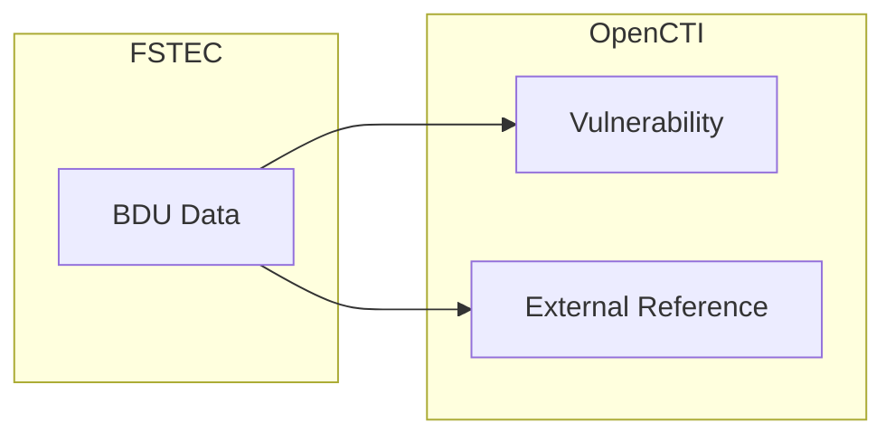

# OpenCTI BDU Connector

| Status | Date | Comment |
|--------|------|---------|
| Filigran Verified | -    | -       |

The BDU Connector imports CVE-like vulnerability data (called as BDU) from the FSTEC into OpenCTI.

## Table of Contents

- [OpenCTI BDU Connector](#opencti-connector-bdu)
  - [Table of Contents](#table-of-contents)
  - [Introduction](#introduction)
  - [Installation](#installation)
    - [Requirements](#requirements)
  - [Configuration variables](#configuration-variables)
    - [OpenCTI environment variables](#opencti-environment-variables)
    - [Base connector environment variables](#base-connector-environment-variables)
    - [Connector extra parameters environment variables](#connector-extra-parameters-environment-variables)
  - [Deployment](#deployment)
    - [Docker Deployment](#docker-deployment)
    - [Manual Deployment](#manual-deployment)
  - [Usage](#usage)
  - [Behavior](#behavior)
  - [Debugging](#debugging)
  - [Additional information](#additional-information)

## Introduction

Connector pulls data from BDU FSTEC Russian Vulnerability Database.

## Installation

### Requirements

- OpenCTI Platform >= 6.9.10

## Configuration variables

There are a number of configuration options, which are set either in `docker-compose.yml` (for Docker) or in `config.yml` (for manual deployment).

### OpenCTI environment variables

| Parameter     | config.yml | Docker environment variable | Mandatory | Description                                          |
|---------------|------------|-----------------------------|-----------|------------------------------------------------------|
| OpenCTI URL   | url        | `OPENCTI_URL`               | Yes       | The URL of the OpenCTI platform.                     |
| OpenCTI Token | token      | `OPENCTI_TOKEN`             | Yes       | The default admin token set in the OpenCTI platform. |

### Base connector environment variables

| Parameter         | config.yml      | Docker environment variable   | Default                                  | Mandatory | Description                                                                 |
|-------------------|-----------------|-------------------------------|------------------------------------------|-----------|-----------------------------------------------------------------------------|
| Connector ID      | id              | `CONNECTOR_ID`                |                                          | Yes       | A unique `UUIDv4` identifier for this connector instance.                   |
| Connector Name    | name            | `CONNECTOR_NAME`              | FSTEC BDU     | No        | Name of the connector.                                                      |
| Connector Scope   | scope           | `CONNECTOR_SCOPE`             | bdu                                      | No        | The scope or type of data the connector is importing.                       |
| Log Level         | log_level       | `CONNECTOR_LOG_LEVEL`         | error                                    | No        | Determines the verbosity of the logs: `debug`, `info`, `warn`, or `error`.  |

### Connector extra parameters environment variables

| Parameter          | config.yml           | Docker environment variable | Default                                      | Mandatory | Description                                                                 |
|--------------------|----------------------|-----------------------------|----------------------------------------------|-----------|-----------------------------------------------------------------------------|
| Base URL           | bdu.base_url         | `BDU_BASE_URL`              | https://bdu.fstec.ru/files/documents/vulxml.zip | No        | NVD API endpoint URL.                                                       |
| Interval           | bdu.interval         | `BDU_INTERVAL`              | 6                                            | No        | Interval in hours between checks.      |

## Deployment

### Docker Deployment

Build the Docker image:

```bash
docker build -t leitosama/opencti-connector-bdu:latest .
```

Configure the connector in `docker-compose.yml`:

```yaml
  connector-bdu:
    image: leitosama/opencti-connector-bdu:latest
    environment:
      - OPENCTI_URL=http://localhost
      - OPENCTI_TOKEN=ChangeMe
      - CONNECTOR_ID=ChangeMe
      - CONNECTOR_NAME=FSTEC BDU
      - CONNECTOR_SCOPE=bdu
      - CONNECTOR_LOG_LEVEL=error
      - BDU_INTERVAL=6
      # - BDU_BASE_URL=https://bdu.fstec.ru/files/documents/vulxml.zip
    restart: always
```

Start the connector:

```bash
docker compose up -d
```

### Manual Deployment

1. Create `config.yml` based on `config.yml.sample`.

2. Install dependencies:

```bash
pip3 install -r requirements.txt
```

3. Start the connector from the `src` directory:

```bash
python3 -m __main__
```

## Usage

The connector runs automatically at the interval defined by `BDU_INTERVAL`. To force an immediate run:

**Data Management → Ingestion → Connectors**

Find the connector and click the refresh button to reset the state and trigger a new sync.

## Behavior

The connector fetches CVE-like data from the FSTEC and converts it to STIX Vulnerability objects.

### Data Flow



### Entity Mapping

| FSTEC BDU Data         | OpenCTI Entity/Property | Description                                      |
|----------------------|-------------------------|--------------------------------------------------|
| BDU ID               | Vulnerability.name      | BDU identifier (e.g., BDU:2025-10116) if no CVE refs |
| Description          | Vulnerability.description | BDU description                                |
| Published Date       | Vulnerability.created   | Date BDU was published                           |
| Last Modified        | Vulnerability.modified  | Last modification date                           |
| CVSS v2 baseScore    | Vulnerability.x_opencti_cvss_v2_base_score | CVSS v2 Base Score            |
| CVSS v2 accessVector | Vulnerability.x_opencti_cvss_v2_access_vector | CVSS v2 Access Vector      |
| CVSS v2 accessComplexity| Vulnerability.x_opencti_cvss_v2_access_complexity | CVSS v2 Access Complexity |
| CVSS v2 authentication | Vulnerability.x_opencti_cvss_v2_authentication | CVSS v2 Authentication  |
| CVSS v2 confidentialityImpact | Vulnerability.x_opencti_cvss_v2_confidentiality_impact | CVSS v2 Confidentiality Impact |
| CVSS v2 integrityImpact | Vulnerability.x_opencti_cvss_v2_integrity_impact | CVSS v2 Integrity Impact |
| CVSS v2 availabilityImpact | Vulnerability.x_opencti_cvss_v2_availability_impact | CVSS v2 Availability Impact |
| CVSS v3.1 baseScore  | Vulnerability.x_opencti_cvss_base_score | CVSS v3.1 base score             |
| CVSS v3.1 baseSeverity | Vulnerability.x_opencti_cvss_base_severity | CVSS v3.1 Base Severity: CRITICAL/HIGH/MEDIUM/LOW |
| CVSS v3.1 attackVector | Vulnerability.x_opencti_cvss_attack_vector | CVSS v3.1 Attack Vector     |
| CVSS v3.1 attackComplexity | Vulnerability.x_opencti_cvss_attack_complexity | CVSS v3.1 Attack Complexity |
| CVSS v3.1 privilegesRequired | Vulnerability.x_opencti_cvss_privileges_required | CVSS v3.1 Privileges Required |
| CVSS v3.1 userInteraction | Vulnerability.x_opencti_cvss_user_interaction | CVSS v3.1 User Interaction |
| CVSS v3.1 scope | Vulnerability.x_opencti_cvss_scope | CVSS v3.1 Scope                            |
| CVSS v3.1 confidentialityImpact | Vulnerability.x_opencti_confidentiality_impact | CVSS v3.1 Confidentiality Impact |
| CVSS v3.1 integrityImpact | Vulnerability.x_opencti_integrity_impact | CVSS v3.1 Integrity Impact |
| CVSS v3.1 availabilityImpact | Vulnerability.x_opencti_availability_impact | CVSS v3.1 Availability Impact |
| CVSS v4.0 baseScore | Vulnerability.x_opencti_cvss_v4_base_score | CVSS v4.0 Base Score           |
| CVSS v4.0 baseSeverity | Vulnerability.x_opencti_cvss_v4_base_severity | CVSS v4.0 Base Severity  |
| CVSS v4.0 attackVector | Vulnerability.x_opencti_cvss_v4_attack_vector | CVSS v4.0 Attack Vector (AV) |
| CVSS v4.0 attackComplexity | Vulnerability.x_opencti_cvss_v4_attack_complexity | CVSS v4.0 Attack Complexity (AC)|
| CVSS v4.0 attackRequirements | Vulnerability.x_opencti_cvss_v4_attack_requirements | CVSS v4.0 Attack Requirements (AT) |
| CVSS v4.0 privilegesRequired | Vulnerability.x_opencti_cvss_v4_privileges_required | CVSS v4.0 Privileges Required (PR)|
| CVSS v4.0 userInteraction | Vulnerability.x_opencti_cvss_v4_user_interaction | CVSS v4.0 User Interaction (UI) |
| CVSS v4.0 vulnConfidentialityImpact | Vulnerability.x_opencti_cvss_v4_confidentiality_impact_v | CVSS v4.0 Confidentiality (VC) |
| CVSS v4.0 subConfidentialityImpact | Vulnerability.x_opencti_cvss_v4_confidentiality_impact_s | CVSS v4.0 Confidentiality (SC) |
| CVSS v4.0 vulnIntegrityImpact | Vulnerability.x_opencti_cvss_v4_integrity_impact_v | CVSS v4.0 Integrity  (VI)|
| CVSS v4.0 subIntegrityImpact | Vulnerability.x_opencti_cvss_v4_integrity_impact_s | CVSS v4.0 Integrity  (SI)|
| CVSS v4.0 vulnAvailabilityImpact | Vulnerability.x_opencti_cvss_v4_availability_impact_v | CVSS v4.0 Availability (VA) |
| CVSS v4.0 subAvailabilityImpact | Vulnerability.x_opencti_cvss_v4_availability_impact_s | CVSS v4.0 Availability (SA) |
| CWE IDs              | Labels                  | Weakness classifications                         |
| References           | External References     | Links to advisories and patches                  |Minimum 2 hours recommended by NIST. |

Notes: 
* If there is a CVE ID in BDU vulnerability refs - object will be named using CVE ID, but BDU ID will be added as alias using `x_opencti_aliases`

### Processing Details

- **CVSS Support**: Connector supports CVSS v2, v3.1, and v4.0

## Debugging

Enable verbose logging:

```env
CONNECTOR_LOG_LEVEL=debug
```

Log output includes:
- BDU processing progress
- STIX conversion details
